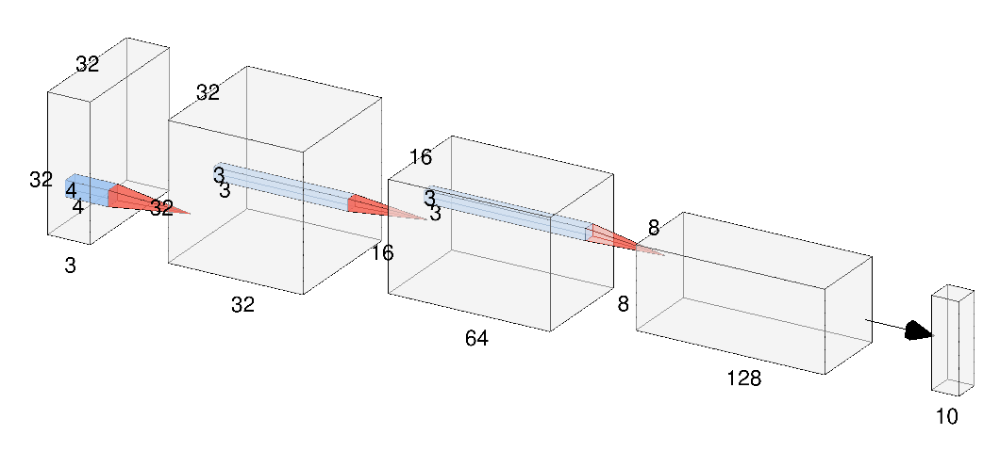
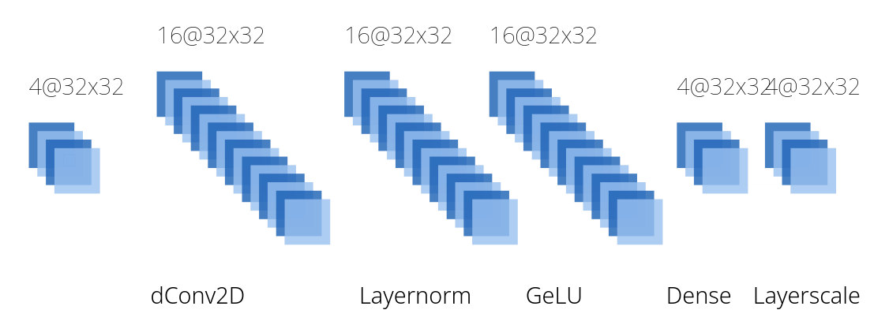
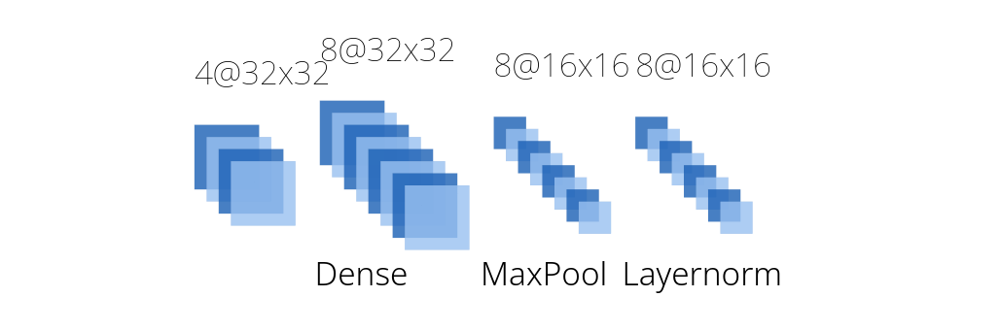
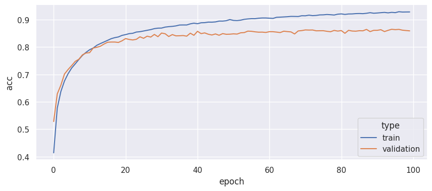
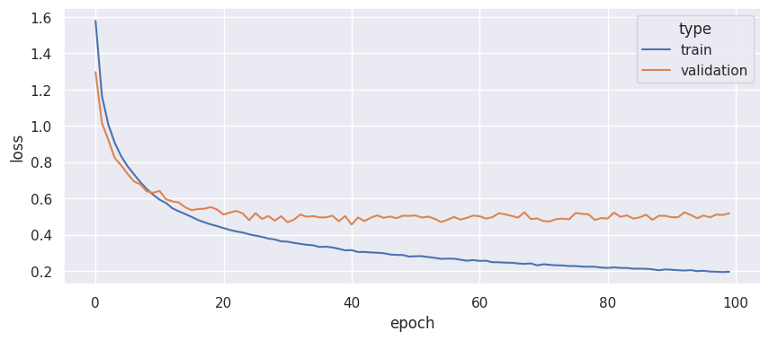
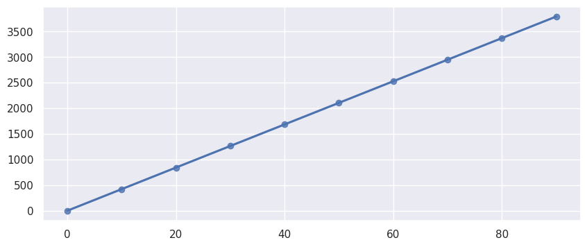

# A Tiny Convolutional Network for CIFAR-10 Dataset

This project implements a small ConvNeXT-esque network adapted for the CIFAR-10 dataset.

> Parameter count: 0.17M

## Training

```sh
python train.py --epoch 10 --batch 32 --augment
python train.py --tpu --epoch 10 --batch 1024 --augment # on a TPU
```

Training and testing data will be download automatically via `tensorflow-datasets`.
All train/test errors and timing will be outputted at the end of training.

## Architecture



This neural network contains a stem layer, 8 bottleneck layers, 2 downscale layers, and one classification head.
They are arranged in the following order:

```
[stem] => [ bottleneck, filter=32, factor=2 ] x2 => [downscale]
       => [ bottleneck, filter=64, factor=4 ] x4 => [downscale]
       => [ bottleneck, filter=128,factor=2 ] x2 => [downscale] => [head]
```

### Bottleneck Architecture

For an input of dimension $(4, 32, 32)$, a bottleneck
would contain 5 layers:



* Depthwise convolution with `kernel_size=3` and depth multiplier `factor`.
* Layer normalization layer.
* GeLU activation layer, as it is superior than ReLU.
* Dense layer with `filter` number of neurons. This is the second step of a depthwise separable convolution.
* Layerscale, which is a filter-wise multiplication layer
between the input and a learned vector.

It uses an "inverted bottleneck" structure, as shown by its
`narrow => wide => narrow` shape.
Additionally, a simple residual connection is made between
the input and the output.
Some noticable changes between this bottleneck architecture
and ConvNeXT's bottleneck:

* Depthwise convolution's filter is much smaller (3x3 vs 7x7),
as CIFAR-10 contains small images of size 32x32.
This means the "expand" part of
an inverted bottleneck can be done in depthwise convolution layer,
as the downside of heavy computation cost is mitigated
by the small filter size.
* Only one `Dense` layer is used, as the "expand" in inverted
bottleneck is now done in depthwise convolution layer,
instead of in another `Dense` layer as done in ConvNeXT.
* An aggressive dropout of 0.5 is introduced between
`GeLU` and `Dense`. This helps with overfitting.

The resulting bottleneck layer has a significantly reduced parameter count (almost half) compared to
a downscaled ConvNeXT bottleneck,
while not being computationally expensive.

### Downscale Architecture

The downscale layer reduces image dimensions
while increasing the number of channels.
It has a different architecture than that of ConvNeXT's:



Compared to a conventional convolution-based downscale layer,
this downscale architecture features a reduced parameter count,
while being at least as fast as convolutional downscaling.

Compared to more traditional maxpool-based downscaling,
this architecture allows inter-channel communication
before potentially useful information is removed in max pooling.

### Classification Head Architecture

The classification head contains a global average pooling layer,
a layer normalization layer, a ReLU, and a single dense layer.

Global average pooling is used instead of flattening
as it makes more sense in depthwise convolutional networks:
each channel represents a single feature.
It also means much less parameters.

## Performance

> The complete data can be found in `timing.py`.

This network performs reasonably well for its parameter count of 0.17M:

* At epoch 10, it reached a training accuracy of 79.03%,
and a validation accuracy of 77.97%.
* At epoch 50, it reached a training accuracy of 89.75%,
and a validation accuracy of 84.84%.
* At epoch 100, it reached a training accuracy of 92.92%,
and **a validation accuracy of 86.47%**.



Similarly, it eventually converged at **a validation loss of ~0.515**.



With a batch size of 32 and a Radeon 6800xt@120W,
**each training epoch takes 41.73 seconds** on average.



With a batch size of 32 and a mixed-precision NVIDIA A10,
each training epoch takes 28 seconds.
With a batch size of 1024 and a Google TPUv2-8,
each takes 5 seconds. However, TPUs have a hard time converging
on small models such as CIFAR-10.

## Model Format

The trained model is stored in `model/<timestamp>`.

It is saved using standard Keras format, and can be loaded
using `tf.keras.models.load_model` function.
It supports any 32x32, unnormalized RGB image.

## Further Improvements

In the validation accuracy plot, we can see that the model
suffered from overfitting, despite utilizing image augmentation and dropout layers. Fortunately, overfitting somehow did *not*
lead to deteriorating validation accuracy, proving the effectiveness of augmentation and dropout.

I suspect the reason for overfitting is the network being
*too small*. It is not deep enough to extract complex information
from images, so the only way its training accuracy would improve
is when it overfitted.
A combination of wider channels and more bottleneck layers
should improve the results.

I also tested a smaller network
(basically the same one with channels reduced by half)
at 49K parameters. It eventually converged at 81% validation accuracy. Interestingly, it took *a lot* more epoch to train,
only passing the 80% accuracy after epoch 50.